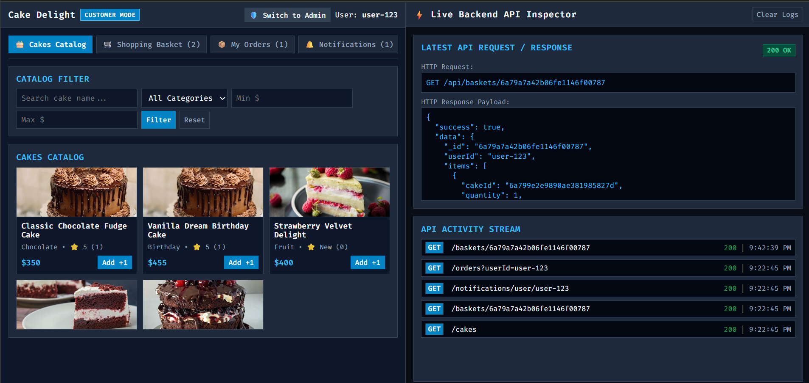

# Cake Delight - Microservices Platform

> **GitHub Repository**: [https://github.com/VISHWAr23/Project_Cap](https://github.com/VISHWAr23/Project_Cap)  
> *For the best reading experience with fully rendered diagrams, images, and interactive navigation, please view this README directly on GitHub.*

---

## Overview

Cake Delight is a lightweight Node.js microservices platform architected with an API Gateway, an event-driven RabbitMQ message broker, and isolated MongoDB databases following the Database-per-Service pattern.

The platform provides complete e-commerce capabilities, including catalog management, basket state operations, order checkout validation, star rating synchronization, and automated order confirmation notifications delivered via asynchronous event messaging.

---

## Quick Navigation & Documentation Links

For detailed deployment and demonstration flows, refer to the dedicated documentation files:

- **[Setup & Execution Instructions](SETUP_INSTRUCTIONS.md)**: Comprehensive guide covering Docker Compose execution, Kubernetes manifests (`kubectl`), network port bindings, and microservice health checks.
- **[End-to-End Application Flow Demonstration](END_TO_END_DEMO.md)**: Technical walkthrough of Customer and Admin workflows, event-driven messaging pipelines, and rating synchronization.
- **[API Documentation](API_DOCUMENTATION.md)**: Technical reference guide for all REST API endpoints, API Gateway proxies, request/response payload schemas, and health check probes across all microservices.

---

## User Interface & 50/50 Split Panel Rationale

### Rationale for the 50/50 Split Layout

The user interface is designed with a **50/50 dual-panel architecture** to provide simultaneous application interaction and real-time backend observability:

1. **Left Panel (50%) — Application Interface**:
   - Serves as the primary user interaction area for both Customer and Admin roles.
   - Features single-line header controls, tabbed navigation bars, cake catalog grid, basket operations, order fulfillment history, rating submission forms, and system health monitors.

2. **Right Panel (50%) — Live Backend API & Payload Inspector**:
   - Provides instant visibility into internal microservice communication without requiring browser DevTools or console logs.
   - Displays the active HTTP Method (`GET`, `POST`, `PUT`, `DELETE`), target Endpoint URL, JSON Request Payload, and raw JSON Response Payload with HTTP Status Codes (`200 OK`, `201 Created`, etc.).
   - Maintains a chronological activity stream of all network calls triggered by UI interactions.

---

### Microservices Responsibilities

1. **API Gateway (`port 3000 / 8080`)**:
   - Serves as the central entry point for incoming client requests.
   - Delivers static web assets and proxies API routes (`/api/cakes`, `/api/baskets`, `/api/orders`, `/api/ratings`, `/api/notifications`) to target backend microservices.

2. **Catalog Service (`port 3001`)**:
   - Manages cake inventory items, categories, pricing, descriptions, stock availability, and image links in `catalog_db`.
   - Computes and stores aggregate ratings (`averageRating`, `ratingCount`).

3. **Order Service (`port 3002`)**:
   - Handles basket state operations and cart item mutations in `order_db`.
   - Validates basket item prices against Catalog Service via REST API during checkout.
   - Persists confirmed orders and publishes `order.created` events to RabbitMQ.

4. **Rating Service (`port 3003`)**:
   - Persists customer ratings and written feedback in `rating_db`.
   - Sends internal REST updates to Catalog Service to recalculate cake average scores asynchronously.

5. **Notification Service (`port 3004`)**:
   - Subscribes to `order.created` events on RabbitMQ queues.
   - Stores notification payloads in `notification_db` for user consumption.

---

## Technology Stack & Infrastructure

- **Backend Language & Framework**: Node.js, Express.js
- **Database System**: 4 Isolated MongoDB instances (Database-per-Service pattern)
- **Event Messaging**: RabbitMQ (AMQP Protocol)
- **Reverse Proxy**: API Gateway (`express-http-proxy`)
- **Frontend Layer**: HTML5, Vanilla CSS3, JavaScript (Fetch API)
- **Containerization & Deployment**: Docker, Docker Compose, Kubernetes Manifests (`k8s/`)
